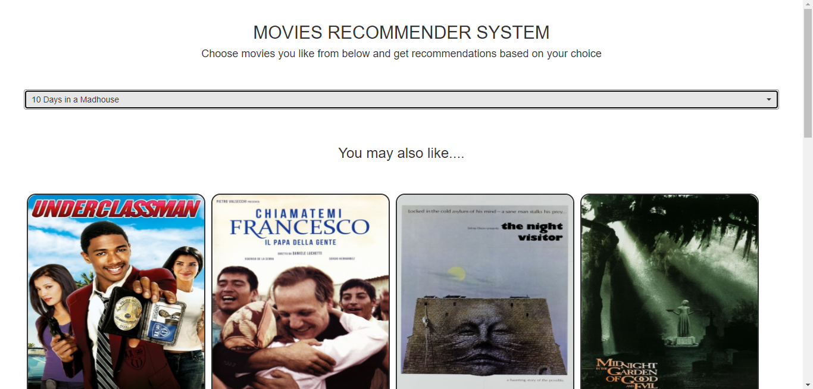

# Gotta watch these too.

A Flask web app for recommending movies to the user.

Th recommendations are offered based on the similarity in the content of the movies.

## Prerequisites

* Install dependencies
```
pip install -r requirements.txt
```


## Usage
* In the main directory run the following command
```
python app.py
```
* You will get a url, go to that url.
In most cases it is this-
```
http://127.0.0.1:5000/ 
```

* The app is hosted locally!!

* Select the movie that you like.

* Movies similar to your choice will be displayed.

## Screenshots




## Demo

Try the web app at [gotta-watch-these-too](https://gotta-watch-these-too.herokuapp.com/).

## Author name

Priya Mane
